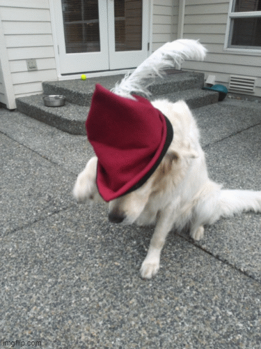
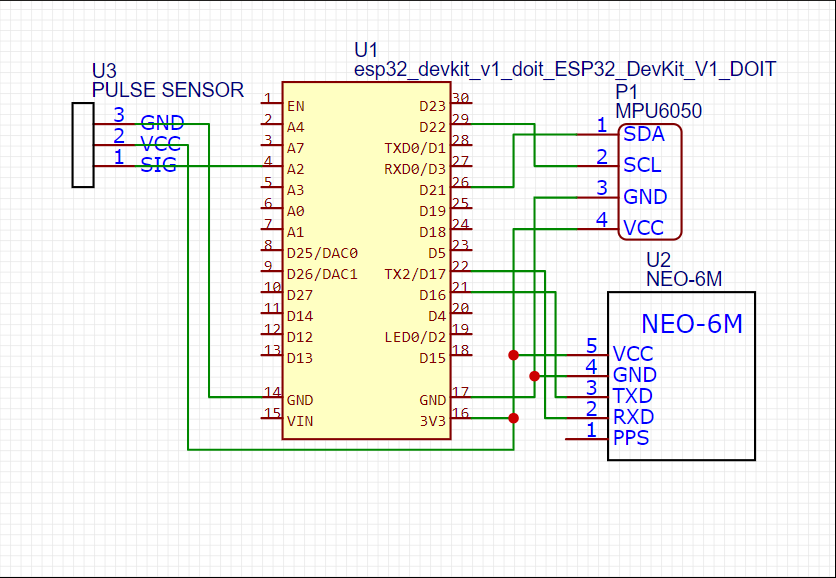
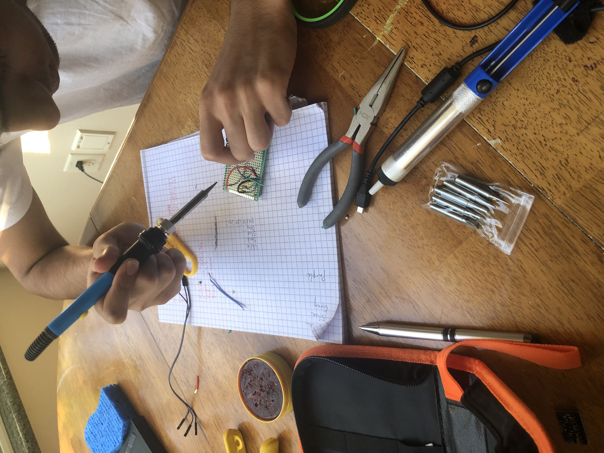
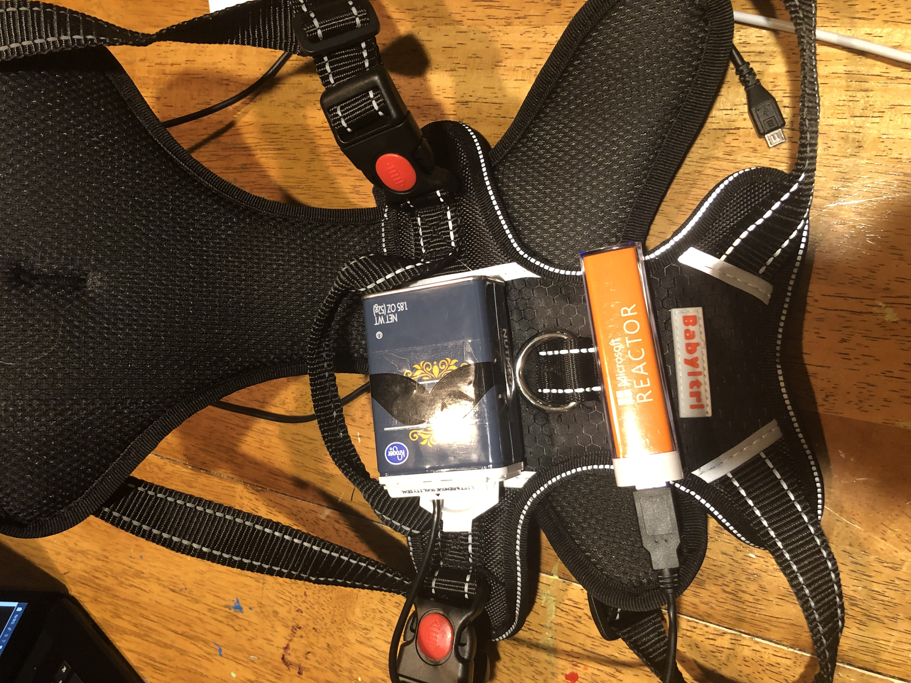
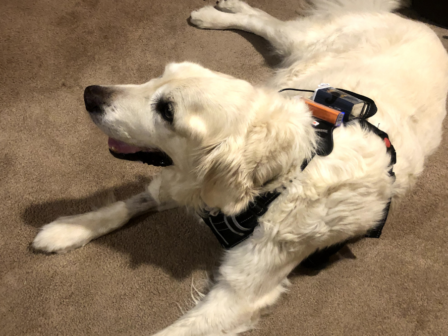
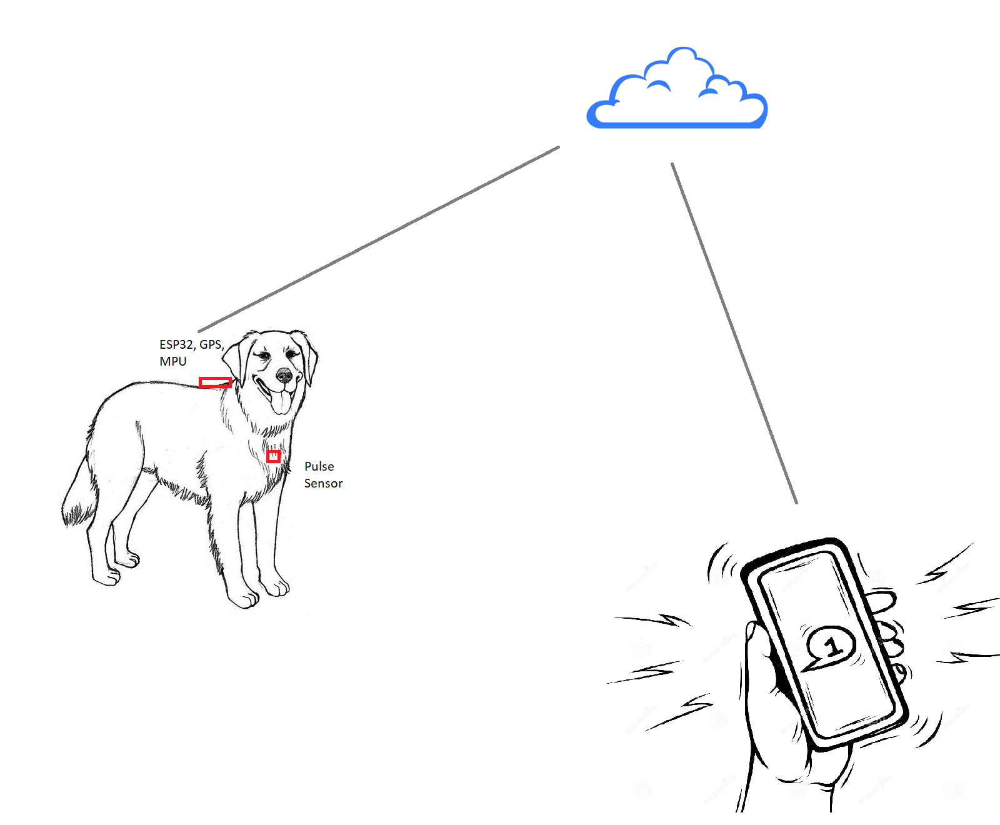

## The Oscar Project

I started the [Oscar project](https://github.com/dhruv-kurpad/oscarProject) with the goal of being notified when my dog was having a seizure. Osacr was a [English Cream Golden Retriever](https://www.loveyourdog.com/english-cream-retriever/) who had a great life! Over the last 6 months Oscar started having seizures that continued to get more frequent and intense. As we were often out of the house, I was concerned that Oscar might have a seizure when none of us were around to help him. 

I wanted to build an app that could notify me if Oscar was having a seizure so I could head home and check on him if he was alone.

## Planning
With the idea of building an app that could identify a seizure and notify me I started looking for ways to build it. In the summer before my junior year, I had built a RC Car from scratch following the awesome tutorials from [Dronebot Workshop](https://dronebotworkshop.com/nrf24l01-wireless-joystick/). 

Here's a quick video of the car!

<iframe width="560" height="315" src="https://www.youtube.com/embed/YOLVyG_D9O8" title="YouTube video player" frameborder="0" allow="accelerometer; autoplay; clipboard-write; encrypted-media; gyroscope; picture-in-picture" allowfullscreen></iframe>

I knew I needed to build a sensor that could detect the movements of a seizure and notify me, I also had ideas about using a GPS to notify me if Oscar ever wandered off to the neighbors yards looking for treats. With these ideas I started thinking about what my prototype would look like. 

### Choosing the Microcontroller

While I had used Arduino Uno for the car and another Uno for the remote on the previous project, I knew I needed a microcontroller that was more capable than the Arduino, I needed something that could handle multiple sensors and could coneect to Wifi. I landed on the [ESP32](https://www.espressif.com/en/products/socs/esp32) because it had all the features I was looking for:
1. Low cost ([The ESP32 devkit on Amazon](https://amzn.to/3D02wyb) is $10.99 )
2. The ESP32 has integrated Wifi and Bluetooth, but I only plan on using the Wifi for now. But the Bluetooth could come handy later.
3. Power consumption, the ESP32 can be put into low power consumption mode for times when I was home to save battery
4. The ESP32 has dual cores so I can collect inputs from the different sensors at varying frequencies and still communicate over Wifi without worrying too much about the controller slowing things down.
5. Finally the ESP32 is much faster processor, [over 10 times faster](https://diyi0t.com/technical-datasheet-microcontroller-comparison/) than a Arduino. Making it possible for me to get sensor readings more frequently.

### Sensors

1. [Accelerometer & Gyroscope](https://amzn.to/3skE855) For the sensors, I obviously needed an Accelerometer and Gyroscope. I settled on the [MPU6050](https://amzn.to/3skE855) primarily because it was not too expensive and I found a number of tutorials online on using it. The MPU6050's purpose was to detect rapid changes in Oscar's orientation while he was on his side(his seizures almost always involved him falling down and thrashing around while on his side)

2. [Pulse Sensor](https://amzn.to/3xKbThz) It turned out that the pulse sensor does not work well when connected to a dog vest. Abandoned the idea, but still looking for a good way to get the pulse reading. I can see that he's panting before, during and after a seizure.

3. [GPS Sensor](https://amzn.to/3skeQnO) Added the Neo-6M GPS module to the mix to see if I could geocode his location and notify myself if he ever wandered out of the yard.

### Other Items

1. [Prototype board](https://amzn.to/2UjII79) to minify the sensor components when done.
2. [Connecting Wires](https://amzn.to/3CUrr6e) to connect and solder the components
3. Soldering iron
4. Hot glue gun 
5. Battery. Rather than try and provide a 3.3V input to the circuit, I am currently using 5V input, the converter to 3.3V is coming in a future version!

### Connections
For the initial prototype I only have the MPU6050 connected. Here's the wiring diagram 

1. MPU6050 

Connected the MPU6050 using the pinouts described above. Here's the Accelerometer working with the readings being printed out on the screen.

<iframe width="560" height="315" src="https://www.youtube.com/embed/jAK7jBeWLAs" title="YouTube video player" frameborder="0" allow="accelerometer; autoplay; clipboard-write; encrypted-media; gyroscope; picture-in-picture" allowfullscreen></iframe>

An image of the completed vest

### The Vest
After all the components were put together I needed to do the following so that Oscar could use it.
1. I placed the components in an old nutmeg container after wrapping them in a paper towel so they wouldn't be damaged(I chose a nutmeg container simply becuase it was the right size and available in my house). I plan on 3D printing a real container, but this works for the test.
2. For this initial test I used a USB poer stick, I will need to work on a more effective power supply.
3. I then used a hot glue gun to attach both the nutmeg container and the power source to the harness(I found a mustache sticker and slapped that on the container). 
Here's an image of Oscar wearing the harness for the first time!

### Sensor Code
 
For the sensor, I use one core of the ESP32 to collect readings from the sensor. I'm currently taking 10 readings a second and add all the readings to an array.
After 10 seconds or 100 readings, I drop a message on a queue that a second task running on the the other core picks up and sends it to the cloud.

#### Cloud Environment
Created an Azure Function to save all the readings and use movement thresholds to determine if the readings are related to a seizure. If a seizure is detected, use an Azure Notification service to send a text message to my phone. The code for the Azure Function is in the cloud folder of the link below.

### Results

Overall the solution worked really well! I did have quite a few false positives, but was able to update the parameters on the motion detection to only notify me when the activity lasted more than 10 seconds. 

I also found the heart rate monitor just did not work well for dogs. It needed firm contact with the skin and ttaching it to the inside of the harness did not work. I am researching other options to get the heart rate. 

#### [Link to the project code - Click here](https://github.com/dhruv-kurpad/oscarProject)